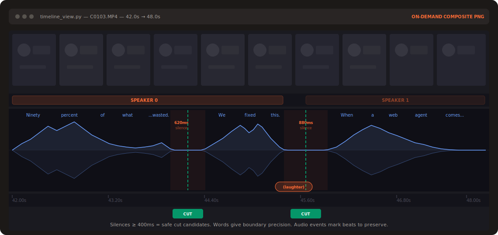

<p align="center">
  
</p>

# vibe-video

Introducing **vibe-video** — edit videos with Claude Code. 100% open source.

Drop raw footage in a folder, chat with Claude Code, get `final.mp4` back. Works for any content — talking heads, montages, tutorials, travel, interviews — without presets or menus.

## What it does

- **Cuts out filler words** (`umm`, `uh`, false starts) and lets silence be kept, audio-cut, or visually checked before cutting
- **Auto color grades** every segment (warm cinematic, neutral punch, or any custom ffmpeg chain)
- **30ms audio fades** at every cut so you never hear a pop
- **Burns subtitles** in your style — 2-word UPPERCASE chunks by default, fully customizable
- **Generates animation overlays** via [HyperFrames](https://github.com/heygen-com/hyperframes), [Remotion](https://www.remotion.dev/), [Manim](https://www.manim.community/), or PIL — spawned in parallel sub-agents, one per animation
- **Monitors live streams** from Kick/Twitch/YouTube via Streamlink + FFmpeg so you can capture live moments into edit-ready files
- **Self-evaluates the rendered output** at every cut boundary before showing you anything
- **Persists session memory** in `project.md` so next week's session picks up where you left off

## Setup prompt

Paste into Claude Code, Codex, Hermes, Openclaw, or any agent with shell access:

```text
Set up https://github.com/MoreiraTv/vibe-video for me.

Read install.md first to install this repo, wire up ffmpeg, and register the skill with whichever agent you're running under. Then read SKILL.md for daily usage, and always read helpers/ because that's where the editing scripts live. After install, don't transcribe anything on your own — just tell me it's ready and wait for me to drop footage into a folder.
```

The agent handles the clone, dependencies, skill registration, and environment checks.

Then point your agent at a folder of raw takes:

```bash
cd /path/to/your/videos
claude    # or codex, hermes, etc.
```

And in the session:

> edit these into a launch video

It inventories the sources, proposes a strategy, waits for your OK, then produces `edit/final.mp4` next to your sources. All outputs live in `<videos_dir>/edit/` — the skill directory stays clean.

## Manual install

If you'd rather do it by hand:

```bash
# 1. Clone and symlink into your agent's skills directory
git clone https://github.com/MoreiraTv/vibe-video ~/Developer/vibe-video
ln -sfn ~/Developer/vibe-video ~/.claude/skills/vibe-video        # Claude Code
# ln -sfn ~/Developer/vibe-video ~/.codex/skills/vibe-video       # Codex

# 2. Install deps
cd ~/Developer/vibe-video
uv sync                         # or: pip install -e .
brew install ffmpeg             # required
brew install streamlink         # optional, for live monitoring
brew install yt-dlp             # optional, for downloading online sources
```

## How it works

The LLM never watches the video. It **reads** it — through two layers that together give it everything it needs to cut with word-boundary precision.

<p align="center">
  
</p>

**Layer 1 — Audio transcript (always loaded).** One transcription call per source gives word-level timestamps, either with local faster-whisper or ElevenLabs Scribe if the machine is too weak for local inference. All takes pack into a single ~12KB `takes_packed.md` — the LLM's primary reading view.

If you want cloud transcription, create a repo `.env` from `.env.example`, set `VIBE_VIDEO_TRANSCRIBE_PROVIDER=elevenlabs`, and add `ELEVENLABS_API_KEY=...`. Local mode remains the default.

```
## C0103  (duration: 43.0s, 8 phrases)
  [002.52-005.36] S0 Ninety percent of video editing is completely repetitive.
  [006.08-006.74] S0 We fixed this.
```

**Layer 2 — Visual composite (on demand).** `timeline_view` produces a filmstrip + waveform + word labels PNG for any time range. Called only at decision points — ambiguous pauses, retake comparisons, cut-point sanity checks.

> Naive approach: 30,000 frames × 1,500 tokens = **45M tokens of noise**.
> Vibe Video: **12KB text + a handful of PNGs**.

## Pipeline

```
Transcribe ──> Pack ──> LLM Reasons ──> EDL ──> Render ──> Self-Eval
                                                              │
                                                              └─ issue? fix + re-render (max 3)
```

The self-eval loop runs `timeline_view` on the _rendered output_ at every cut boundary — catches visual jumps, audio pops, hidden subtitles. You see the preview only after it passes.

## Live Monitoring

If you want to monitor a live and pull clips into the same editing workflow, use:

```bash
python helpers/live_monitor.py start https://kick.com/jonvlogs
python helpers/live_monitor.py list
python helpers/live_monitor.py read <session_id> --path-only
python helpers/live_monitor.py stop <session_id>
```

Each session gets its own ID plus files like `transcript_buffer.md`, `transcript.jsonl`, `events.jsonl`, `segments/`, and `transcripts/` under `edit/live_monitor/sessions/<session_id>/`. This helper depends on `streamlink` plus `ffmpeg`.

## Guided Templates

You can start an edit from a reusable template instead of briefing everything from scratch.

```bash
python helpers/templates.py list
python helpers/template_wizard.py vertical-gameplay-facecam --edit-dir /path/to/edit
python helpers/template_wizard.py vertical-vlog-blur-bg --edit-dir /path/to/edit
python helpers/templates.py create-from-edit --edit-dir /path/to/edit --name "My Vertical Vlog"
python helpers/templates.py apply-setup --setup /path/to/edit/template_setup.json --edl /path/to/edit/edl.json
```

The wizard writes:

- `edit/template_setup.json` with the resolved brief for this edit
- `edit/template_defaults.json` with remembered answers for the next run

Initial templates:

- `vertical-gameplay-facecam`
- `vertical-vlog-blur-bg`
- `horizontal-best-moments`
- `speaker-vertical`

The setup covers things like layout, split mode, title/logo behavior, silence policy, subtitle position, 2/3/4/5-word grouping or natural phrasing, karaoke vs plain captions, outline strength, and font preset. After the setup is done, the user can still change anything in conversation.

## Silence Handling

Before editing, the agent should ask whether silent stretches are allowed to be cut.

- If the user says not to cut silence, keep those beats.
- If the user says to cut silence, prefer `visual` mode so a reaction, gesture, or on-camera moment is not removed just because the audio is quiet.
- Use `audio` mode only when the user explicitly wants aggressive silence trimming from transcript timing alone.

```bash
python helpers/build_edl.py --edit-dir /path/to/edit --silence-policy keep
python helpers/build_edl.py --edit-dir /path/to/edit --silence-policy visual
python helpers/build_edl.py --edit-dir /path/to/edit --silence-policy audio
```

## Design principles

1. **Text + on-demand visuals.** No frame-dumping. The transcript is the surface.
2. **Audio is primary, visuals arbitrate silence.** Speech boundaries drive the cut, but silent beats can be preserved when the user wants them or when the image still matters.
3. **Ask → confirm → execute → self-eval → persist.** Never touch the cut without strategy approval.
4. **Zero assumptions about content type.** Look, ask, then edit.
5. **12 hard rules, artistic freedom elsewhere.** Production-correctness is non-negotiable. Taste isn't.

See [`SKILL.md`](./SKILL.md) for the full production rules and editing craft.
